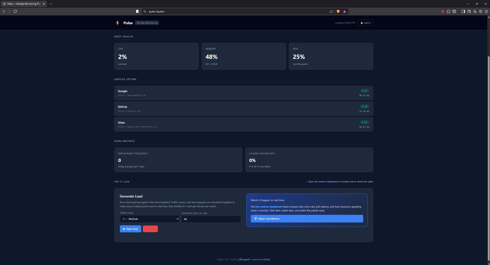
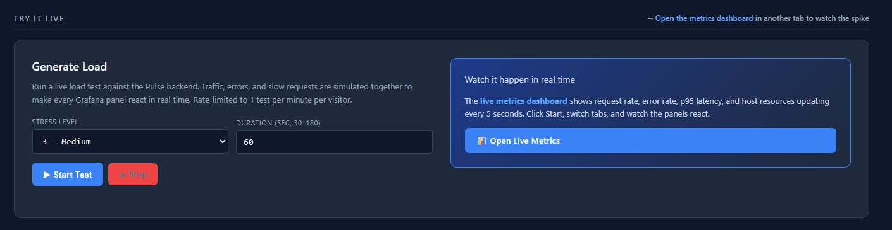
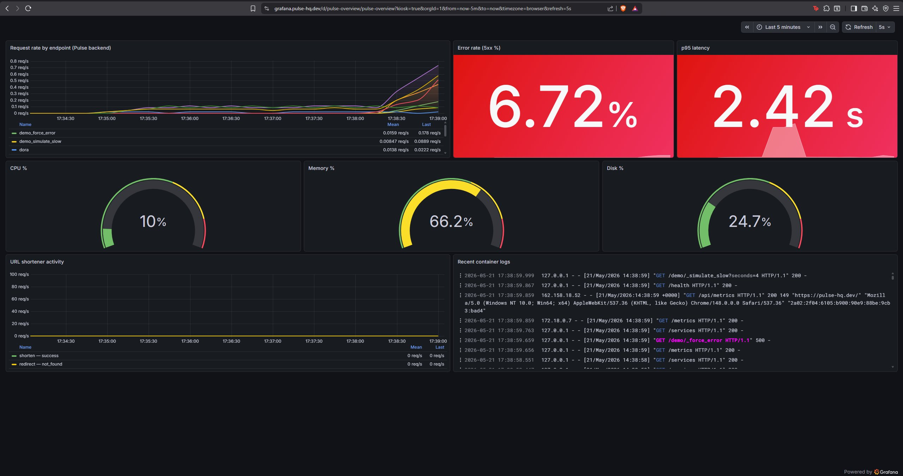
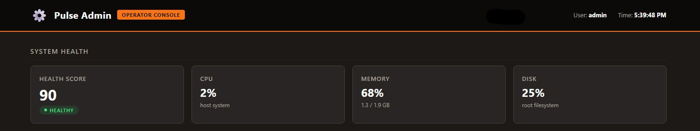
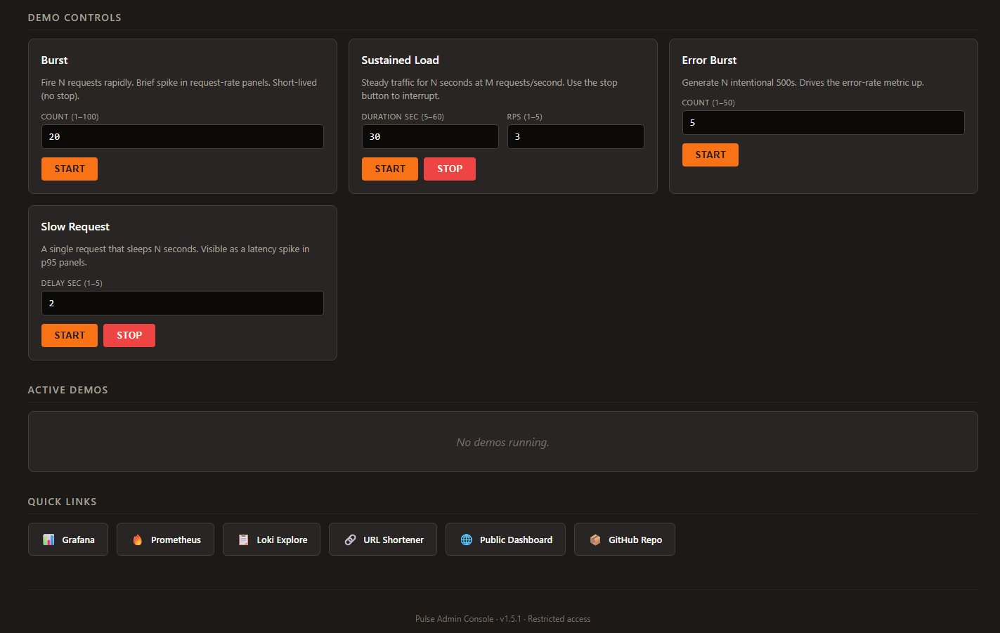
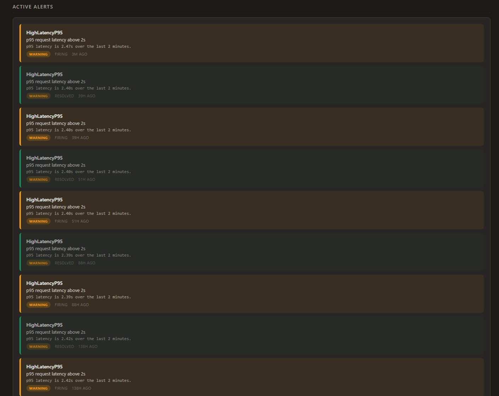
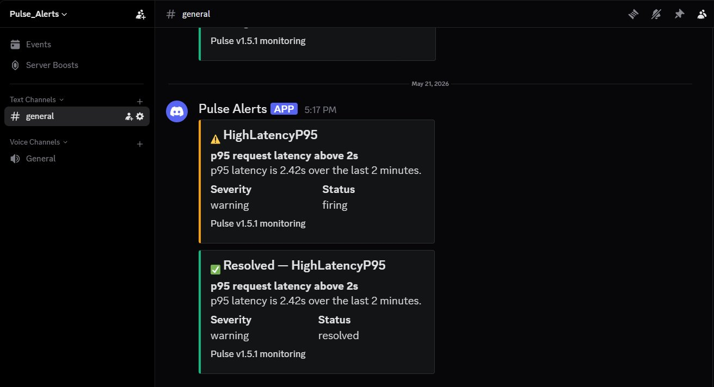
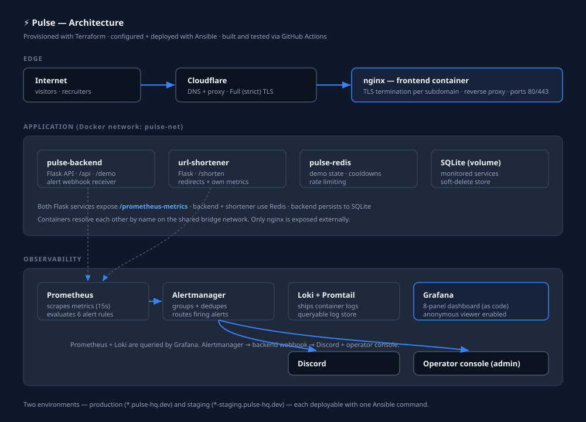

# ⚡ Pulse — DevOps Monitoring Platform

A production-style observability platform running live on AWS. Pulse monitors
system health, service uptime, and DORA metrics, ships a full metrics + logs +
alerting stack, and exposes an interactive load-testing surface so anyone can
watch the platform react to traffic in real time.

**Live:** [pulse-hq.dev](https://pulse-hq.dev) · **Dashboards:** [grafana.pulse-hq.dev](https://grafana.pulse-hq.dev/d/pulse-overview?kiosk) · **Built by** [@Bragashh](https://github.com/Bragashh)



---

## What it does

Pulse is a small fleet of containers deployed across AWS EC2 instances that
together provide:

- A **public dashboard** showing live host health (CPU / memory / disk), service
  uptime checks, and DORA metrics (deployment frequency, change failure rate).
- An **interactive load tester** ("Try It Live") that generates real traffic,
  errors, and latency against the platform — visitors can pick a stress level and
  watch every Grafana panel react.
- A full **observability stack** — Prometheus for metrics, Loki for logs, Grafana
  for dashboards, all wired together and provisioned as code.
- An **alerting pipeline** that fires on operational conditions (error rate,
  latency, resource pressure, service down) and delivers notifications to Discord
  and an in-app operator console.
- A second service — a **URL shortener** — to demonstrate multi-service
  observability through the same stack.
- An **operator console** (admin) with granular load-test controls, system health,
  and live alert status, protected behind authentication.

Everything is provisioned with Terraform, configured and deployed with Ansible,
and built/tested through GitHub Actions.

---

## Screenshots

### Public dashboard — "Try It Live" load tester
Pick a stress level and duration, click Start, and watch the metrics dashboard
react. Rate-limited per visitor.



### Grafana — live overview during a load test
Request rate climbing, error rate at 6.72%, p95 latency spiking, host gauges, URL
shortener activity, and a live log stream from Loki — all refreshing every 5s.



### Operator console
A separate admin surface with its own visual identity. Granular demo controls
(burst / sustained / errors / slow), live system health, quick links.




### Alerts — in-app and on Discord
Firing and resolved alerts appear in the operator console and are pushed to a
Discord channel with formatted embeds.




---

## Architecture



All containers share a Docker bridge network (`pulse-net`) and address each other
by name. Only nginx (ports 80/443) is exposed to the internet; every other service
is reachable only from inside the network, behind authentication where applicable.

The platform runs across two environments — **production** (`*.pulse-hq.dev`) and
**staging** (`*-staging.pulse-hq.dev`) — deployable from a single command each.

---

## Subdomains

| URL | Purpose | Access |
|-----|---------|--------|
| `pulse-hq.dev` | Public dashboard | Open |
| `grafana.pulse-hq.dev` | Grafana dashboards | Anonymous viewer |
| `prometheus.pulse-hq.dev` | Prometheus UI | Basic auth |
| `s.pulse-hq.dev` | URL shortener | Open |
| _(private)_ | Operator console | Basic auth |

The operator console runs on its own subdomain, kept private and protected by
authentication. Staging mirrors the public subdomains with a hyphen suffix
(e.g. `grafana-staging.pulse-hq.dev`).

---

## Tech stack

**Infrastructure**
- **Terraform** — provisions EC2 instances, Elastic IPs, EBS volumes, security groups
- **Ansible** — configures hosts and deploys containers via modular roles
- **Docker** — container runtime; every service runs as a container
- **AWS EC2** — two Ubuntu instances (production + staging)
- **Cloudflare** — DNS + edge proxy
- **Let's Encrypt / certbot** — automated TLS per subdomain

**Application**
- **Python / Flask** — backend API and URL shortener
- **prometheus_client** — metrics instrumentation
- **psutil** — host resource metrics
- **Redis** — demo state and rate limiting
- **SQLite** — monitored-services store
- **nginx** — TLS termination and reverse proxy

**Observability**
- **Prometheus** — metrics database + alert rule evaluation
- **Grafana** — dashboards (provisioned as code)
- **Loki + Promtail** — log aggregation and shipping
- **Alertmanager** — alert grouping and routing
- **Discord** — external alert delivery

**CI/CD**
- **GitHub Actions** — runs tests, builds images, pushes to AWS ECR

---

## Key features

**Observability dashboard.** A provisioned 8-panel Grafana dashboard shows request
rate by endpoint, error rate, p95 latency, host resource gauges, URL-shortener
activity, and a live log stream — refreshing every 5 seconds, viewable without
login.

**Interactive load testing.** The public page exposes a single unified load
generator (stress level 1–5, 30–180s) that simultaneously drives traffic, errors,
and slow requests. The operator console additionally exposes four granular
controls. All requests are guarded by per-visitor cooldowns and a global
concurrency cap, enforced server-side via Redis.

**Alerting end-to-end.** Six Prometheus alert rules (error rate, latency, CPU,
memory, disk, backend-down) fire into Alertmanager, which forwards to a Flask
webhook in the backend that formats and posts to Discord — and caches recent
alerts for the operator console to display.

**Multi-environment.** Production and staging are byte-for-byte the same
deployment, parameterised by Ansible inventory and rendered templates, each
deployable with one command.

**Infrastructure as code.** Nothing is hand-configured on the servers — Terraform
defines the machines, Ansible defines everything that runs on them, and templates
render per-environment configs (nginx, the public page, Alertmanager).

---

## Deployment

The deployment chain, top to bottom:

```
1. Terraform     →  creates EC2s, EIPs, security groups
2. GitHub Actions →  on push: runs tests, builds images, pushes to ECR
3. Ansible        →  installs Docker, renders configs, runs containers
4. Containers     →  serve traffic behind nginx + Cloudflare
```

Deploy commands (per environment):

```bash
cd ansible
ansible-playbook -i inventory/production.ini playbooks/deploy-pulse.yml
ansible-playbook -i inventory/production.ini playbooks/deploy-monitoring.yml
ansible-playbook -i inventory/production.ini playbooks/deploy-services.yml
```

(Swap `production.ini` for `staging.ini` to target staging.)

---

## Project structure

```
pulse/
├── terraform/              # AWS infrastructure (EC2, EIP, security groups)
├── ansible/                # Configuration + deployment
│   ├── roles/              #   common, pulse, monitoring, services
│   ├── playbooks/          #   deploy-pulse, deploy-monitoring, deploy-services
│   ├── inventory/          #   production.ini, staging.ini
│   └── vault.yaml          #   encrypted secrets
├── portal/
│   ├── backend/            # Flask API: db, metrics, demo, alerts (48 tests)
│   └── frontend/           # admin.html (public page templated via Ansible)
├── services/
│   └── url-shortener/      # Second Flask service + Redis
├── monitoring/
│   ├── prometheus.yml      # Scrape config + Alertmanager pointer
│   ├── alerts/             # Alert rules
│   ├── alertmanager/       # Alertmanager config (templated)
│   └── grafana/            # Provisioned datasources + dashboard
├── .github/workflows/      # CI: test, build, push to ECR
└── docs/                   # Summary, tools reference, screenshots
```

---

## Testing

48 backend tests covering the database layer, API endpoints, the demo subsystem
(bounds, cooldown, concurrency, admin bypass, stop, full-spectrum orchestration),
and the alert webhook.

```bash
cd portal/backend
pytest
```

Tests run automatically on every push via GitHub Actions before any image is built.

---

## Notes on design decisions

- **Hyphen-suffix staging** (`grafana-staging.pulse-hq.dev`) rather than nested
  subdomains, because Cloudflare's free Universal SSL does not cover two-level
  wildcards.
- **Backend as alert forwarder** rather than Alertmanager → Discord directly:
  Alertmanager's built-in receivers expect Slack-format payloads and Discord's
  compatibility endpoint is finicky; routing through a small Flask endpoint gives
  full control over the Discord payload and a natural place to cache alerts for
  the operator console.
- **Anonymous Grafana viewer** so the dashboards can be opened from the public
  page without credentials.
- **Single Redis** shared by the backend and the URL shortener, since both need
  rate limiting and the services are co-located.

---

## Author

Built by [@Bragashh](https://github.com/Bragashh).

This is a portfolio project demonstrating end-to-end DevOps practice: infrastructure
as code, configuration management, containerization, CI/CD, observability, and
alerting on live cloud infrastructure.
